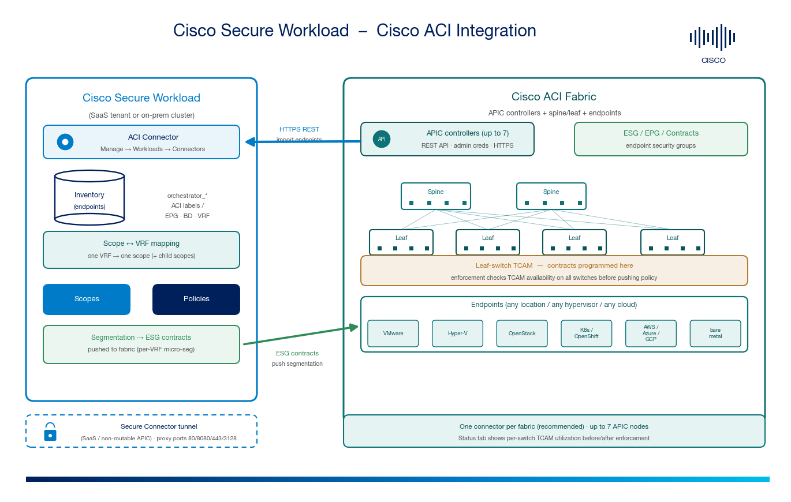

# Cisco Secure Workload → Cisco ACI Integration Guide

A step-by-step, **beginner-friendly** guide to integrating a **Cisco Application Centric Infrastructure (ACI)** fabric with **Cisco Secure Workload (CSW)** using the **ACI connector** — importing **fabric endpoints and labels** into CSW inventory, mapping **VRFs to CSW scopes**, and pushing **micro-segmentation into the fabric via Endpoint Security Groups (ESGs)** programmed into leaf-switch TCAM.

The ACI integration is **two-way**:

1. The **ACI connector** talks to the **APIC** REST API to import **endpoints, IPs, and ACI labels** (EPG / BD / VRF context) into CSW as `orchestrator_*` labels.
2. CSW maps each **VRF to a scope** and can **push segmentation** into the fabric using **ESGs / contracts** — enforced regardless of where or how the workloads run.

> **⚠ Disclaimer:** This is a **community reference guide** prepared by Cisco Solutions Engineering — not an official Cisco product document. Always refer to the [official Cisco Secure Workload documentation](https://www.cisco.com/c/en/us/support/security/tetration/series.html), the [Connectors guide](https://www.cisco.com/c/en/us/td/docs/security/workload_security/secure_workload/user-guide/4_0/cisco-secure-workload-user-guide-on-prem-v40/configure-and-manage-connectors-for-secure-workload.html), the [Cisco ACI documentation](https://www.cisco.com/c/en/us/support/cloud-systems-management/application-policy-infrastructure-controller-apic/series.html), and the [Compatibility Matrix](https://www.cisco.com/c/m/en_us/products/security/secure-workload-compatibility-matrix.html) for authoritative, up-to-date guidance.

---

## 0. New to CSW + ACI? Read this first (2 minutes)

- **Cisco Secure Workload (CSW)** builds **least-privilege micro-segmentation** from **labels → scopes → policies**, enforcing at the workload and — with ACI — at the **fabric**.
- **Cisco ACI** is a policy-driven data-center fabric (APIC controllers + spine/leaf switches) that groups endpoints into **EPGs / ESGs** and connects them with **contracts**.

**Why integrate them?**

| Problem without the integration | What the integration gives you |
|---|---|
| CSW policy and ACI fabric policy are authored separately and can drift | CSW imports **ACI endpoints + labels** and maps **VRF → scope**, giving one consistent segmentation model |
| No CSW visibility of what lives on the ACI fabric | CSW gains **visibility of workloads/IPs** belonging to the ACI fabric and the **labels ingested from ACI** |
| Enforcing east-west inside the fabric requires manual EPG/contract work | CSW can **push ESG contracts** into the fabric per-VRF for micro-segmentation |
| Mixed estate (VMs, containers, cloud, bare metal) attached to ACI | The ACI connector covers **virtualization (vCenter/Hyper-V/OpenStack), containers (K8s/OpenShift), and clouds (AWS/Azure/GCP)** |

> **Key idea:** the ACI connector **extends the capabilities of the cloud connectors and the FMC connector**, and **adds**: (1) visibility of workloads/IPs in the ACI fabric, (2) visibility of labels ingested from ACI, and (3) **Scope-to-ACI (VRF) mapping**.

---

## 1. Architecture

*The ACI connector imports fabric endpoints and labels from the APIC over HTTPS (REST) into CSW inventory. Each ACI VRF is mapped to a CSW scope. When you enforce, CSW translates policy intent into ESG contracts that are pushed into the fabric and programmed into leaf-switch TCAM. For SaaS or non-routable APICs the path rides a Secure Connector tunnel.*

| # | Component | Where it runs | Role |
|---|---|---|---|
| 1 | **Control / management plane** | CSW SaaS tenant or on-prem cluster | Labels, scopes, policies; runs the ACI connector |
| 2 | **ACI connector** | Created on the CSW management plane | Talks to **APIC** REST API to import endpoints/labels and push ESG segmentation |
| 3 | **APIC controllers** | ACI fabric (up to 7 nodes) | Fabric control plane; source of endpoint/EPG/BD/VRF data and target for ESG contracts |
| 4 | **Spine / leaf + endpoints** | ACI fabric | Endpoints (VMs, containers, cloud, bare metal); contracts programmed into leaf **TCAM** |

| Path | Direction | Transport | Purpose |
|---|---|---|---|
| **Endpoint / label import** | APIC → CSW | HTTPS REST (TLS) | Import endpoints, IPs, EPG/BD/VRF labels → `orchestrator_*` |
| **ESG enforcement** | CSW → APIC → fabric | HTTPS REST (TLS) | Push ESG contracts for mapped VRFs (programmed into leaf TCAM) |

---

## 2. What you get

**Inventory & labels** — endpoints attached to the ACI fabric become CSW inventory, enriched with ACI context (EPG, Bridge Domain, VRF, tenant) as `orchestrator_*` labels you can search, scope, and enforce on.

**Scope ↔ VRF mapping** — map each ACI **VRF** to a single CSW **scope** so that fabric segmentation and CSW policy share one model. All child scopes under the mapped scope are considered during enforcement.

**Fabric micro-segmentation via ESGs** — CSW can push **Endpoint Security Group** contracts into the fabric for VRFs where you enable segmentation, extending zero-trust into the ACI data plane.

**Broad workload coverage** — because ESGs gather telemetry regardless of where the workload runs, the ACI connector spans:

| Category | Platforms |
|---|---|
| Virtualization | VMware vCenter, Microsoft Hyper-V, OpenStack |
| Containers | Kubernetes, OpenShift |
| Clouds | AWS, Azure, GCP |
| Physical | Bare-metal endpoints on the fabric |

---

## 3. Prerequisites

### ACI side
- A **Cisco ACI fabric** with reachable **APIC** controllers (REST API over HTTPS).
- **APIC admin credentials** (username/password) for a service account with rights to read endpoints and write ESG/contract objects for the target VRFs.
- The **IP addresses (and ports)** of the APIC nodes — **up to 7** APIC nodes per connector.
- Fabric leaf switches with **sufficient TCAM** for the contracts you intend to push (see [§8](#8-tcam--enforcement-status)).

### Cisco Secure Workload side
- CSW **4.x** (on-prem or SaaS). ACI connector lives under **Manage → Workloads → Connectors**.
- A user with **Site Admin / Root Scope Owner** rights.
- For **SaaS** or a non-routable APIC: a healthy **Secure Connector** tunnel.

### Network / firewall
- **HTTPS** from the CSW source (on-prem cluster egress / SaaS Secure Connector VM) **→ each APIC node**.
- If a proxy is required, CSW supports proxy ports **80, 8080, 443, 3128**.

> **One connector per fabric (recommended).** A fabric *can* have more than one connector, but Cisco recommends a **single connector per fabric** to avoid unknown policy issues.

---

## 4. Configure the ACI connector

**Path:** `Manage → Workloads → Connectors → ACI Connector → Configure Your New Connector`

### Step 1 — Connector settings

| Attribute | Required | Value / guidance |
|---|---|---|
| **Connector Name** | ✅ | Unique per tenant, e.g. `aci-dc1-fabric` |
| **Description** | ❌ | Short description, e.g. "DC1 ACI fabric — endpoints + ESG segmentation" |
| **APIC nodes** | ✅ | IP addresses **and port numbers** of the APIC nodes — **max 7** |
| **Credentials** | ✅ | APIC **username** + **password**; select/clear the **Self-signed certificate** checkbox to match your APIC's cert |
| **Connectivity** | ✅ | **No proxy** (CSW reaches APIC directly), **Secure Connector** (tunnel), or **HTTP Proxy** (ports 80 / 8080 / 443 / 3128) |

Click **Save**.

> **Security (per repo policy):** store APIC credentials in your secrets manager; never commit them. CSW stores them encrypted. Prefer a **least-privilege** APIC service account over a full fabric-admin login.

### Step 2 — (SaaS / non-routable) Secure Connector tunnel

Skip if the CSW on-prem cluster can reach the APIC directly. For **SaaS** or a segmented management network:
1. **Manage → Workloads → Secure Connector** → register the client on a Linux VM that **can** reach the APIC nodes.
2. Confirm the Secure Connector is **Active/Connected**, then choose **Secure Connector** connectivity on the ACI connector.

---

## 5. Verify the endpoint / label import

1. **Connector health:** `Manage → Workloads → Connectors → ACI` → your connector shows a **healthy/connected** status (first full snapshot is asynchronous — allow ~1 minute).
2. **Inventory & labels:** `Investigate → Inventory Search` → confirm fabric endpoints appear and carry `orchestrator_*` labels (EPG / BD / VRF context).
3. **Coverage:** confirm the workload categories you expect (VMware / Hyper-V / OpenStack / K8s / OpenShift / cloud / bare metal) are represented.

---

## 6. Map VRFs to CSW scopes

This is the step that ties fabric segmentation to CSW policy.

**Path:** ACI connector → **VRF to Scope Mapping** tab → **Add mapping**

| Rule | Detail |
|---|---|
| **One VRF → one scope** | Map each VRF to exactly one CSW scope. When policies are enforced, **all child scopes** under the mapped scope are considered. |
| **Enable / disable segmentation** | Toggle segmentation per mapped VRF from this tab. |
| **Allow micro-segmentation** | Edit the **VRF EPG** and tick **"allow micro-segmentation"** so ESG-based intra-VRF segmentation can be programmed. |

> **Design tip:** keep a clean 1:1 VRF↔scope model. Mixing multiple VRFs into one scope (or vice-versa) makes enforcement outcomes hard to predict.

---

## 7. Enforce segmentation (ESG contracts)

Once VRFs are mapped and segmentation is enabled:

1. Build/validate policy in the mapped scope using CSW **policy discovery** and **live analysis** (no enforcement) — exactly as for any CSW scope.
2. When you **enforce**, CSW translates intent into **ESG contracts** and pushes them to the fabric for the mapped VRFs.
3. CSW checks **TCAM availability** on all participating switches **before** pushing (see [§8](#8-tcam--enforcement-status)); policy is committed only when there is sufficient TCAM.
4. Roll out **per VRF / per scope**, validating allowed vs. denied flows at each step.

> **Where enforcement happens:** with the ACI connector, segmentation is realized as **fabric ESG contracts** (leaf TCAM). You can still enforce on the **workloads themselves** with CSW agents where installed — use the model that fits each tier.

---

## 8. TCAM & enforcement status

The connector's **Status** tab reports **TCAM utilization for all fabric switches**.

- When the enforcement process starts, CSW checks **TCAM availability** across participating switches.
- Policies are pushed **only when all participating switches have sufficient TCAM**; then enforcement completes.
- Watch TCAM headroom before large policy pushes — insufficient TCAM will block or partially apply enforcement.

| Symptom | Likely cause | Action |
|---|---|---|
| Enforcement doesn't complete | One or more leaf switches low on TCAM | Free TCAM / reduce contract count / stagger rollout; re-check the Status tab |
| Policy applies to some switches only | Uneven TCAM across leaves | Review per-switch utilization on the Status tab |

---

## 9. Caveats & troubleshooting

| Symptom / topic | Guidance |
|---|---|
| **Connector not connecting** | Verify HTTPS reachability to **all** APIC nodes, correct **credentials**, and that the **Self-signed certificate** checkbox matches the APIC's certificate. Check proxy port (80/8080/443/3128) if used. |
| **SaaS / APIC not routable** | Configure the **Secure Connector** and select it as the connectivity method. |
| **No endpoints / labels imported** | Confirm the APIC service account can read fabric/endpoint objects; confirm the fabric actually has learned endpoints. |
| **Segmentation not enforcing on a VRF** | Ensure the VRF is **mapped to a scope**, **segmentation is enabled** for it, and **"allow micro-segmentation"** is ticked on the VRF EPG. |
| **Enforcement stalls / partial** | Check **TCAM utilization** on the Status tab ([§8](#8-tcam--enforcement-status)). |
| **Multiple connectors on one fabric** | Supported but **not recommended** — use a single connector per fabric to avoid unknown policy issues. |
| **More than 7 APIC nodes** | Not supported — a connector accepts **up to 7** APIC nodes. |

---

## 10. FAQs

**Q: What does the ACI connector import?**
A: Fabric **endpoints and IPs**, plus **ACI labels** (EPG / Bridge Domain / VRF / tenant context) as `orchestrator_*` labels, and it supports **Scope-to-VRF mapping**.

**Q: Does the ACI connector enforce policy?**
A: **Yes.** In addition to visibility, CSW can push **ESG contracts** into the fabric for mapped VRFs (programmed into leaf TCAM), which is what distinguishes it from a label-only orchestrator.

**Q: What workload types does it cover?**
A: Virtualization (**vCenter, Hyper-V, OpenStack**), containers (**Kubernetes, OpenShift**), and clouds (**AWS, Azure, GCP**), plus bare metal — ESGs gather telemetry regardless of where workloads run.

**Q: How many APIC nodes and connectors?**
A: **Up to 7 APIC nodes** per connector; a fabric can have more than one connector but **one per fabric is recommended**.

**Q: How do I know if enforcement will succeed?**
A: The **Status** tab shows per-switch **TCAM utilization**; CSW verifies sufficient TCAM on all participating switches before pushing policy.

**Q: Can I run this from SaaS?**
A: **Yes** — use the **Secure Connector** tunnel (or an HTTP proxy on port 80/8080/443/3128) when the APIC isn't directly reachable.

---

## 11. Video references

> There is no dedicated "CSW + ACI connector" video in the public catalog; the videos below cover the **connector / label-import** pattern, **scopes**, and **enforcement discipline** that this integration builds on.

| Video | Why it's relevant |
|---|---|
| [Connector Overview](https://youtu.be/H6QxuouzeC8) | What connectors do and how they enrich telemetry with fabric context |
| [Cisco Secure Workload: Labels](https://www.youtube.com/watch?v=NLoZq0wiTU8) | How imported ACI labels (EPG/BD/VRF) drive policy |
| [Cisco Secure Workload: Scopes](https://www.youtube.com/watch?v=3KBmanCNm4U) | Scope design — directly relevant to VRF→scope mapping |
| [Production and Test Risk Reduction](https://www.youtube.com/watch?v=HKT18Ylt4IY) | Monitor → enforce rollout discipline before pushing ESG contracts |
| [CSW-User-Education library](https://github.com/chandrapati/CSW-User-Education) | Full curated CSW learning path |

> *Tetration* is the former product name for Cisco Secure Workload — the concepts apply directly.

---

## 12. References

- [CSW — Connectors (On-Prem 4.0, ACI Connector section)](https://www.cisco.com/c/en/us/td/docs/security/workload_security/secure_workload/user-guide/4_0/cisco-secure-workload-user-guide-on-prem-v40/configure-and-manage-connectors-for-secure-workload.html)
- [CSW — Connectors (SaaS 4.0)](https://www.cisco.com/c/en/us/td/docs/security/workload_security/secure_workload/user-guide/4_0/cisco-secure-workload-user-guide-saas-v40/m-connectors.html)
- [CSW — OpenAPI](https://www.cisco.com/c/en/us/td/docs/security/workload_security/secure_workload/user-guide/4_0/cisco-secure-workload-user-guide-on-prem-v40/secure-workload-openapis.html)
- [CSW Compatibility Matrix](https://www.cisco.com/c/m/en_us/products/security/secure-workload-compatibility-matrix.html)
- [Cisco ACI / APIC documentation](https://www.cisco.com/c/en/us/support/cloud-systems-management/application-policy-infrastructure-controller-apic/series.html)
- [Cisco ACI Endpoint Security Groups (ESG) white paper](https://www.cisco.com/c/en/us/solutions/collateral/data-center-virtualization/application-centric-infrastructure/white-paper-c11-743951.html)
- [Secure Connector (SaaS / private network)](https://github.com/chandrapati/csw-secure-connector)
